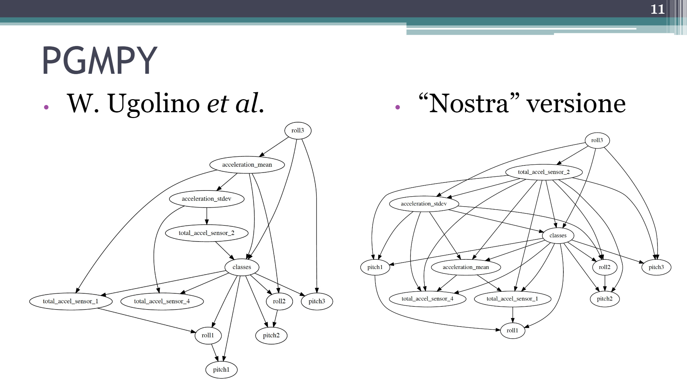
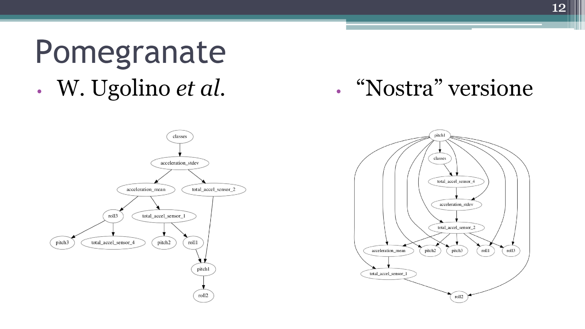
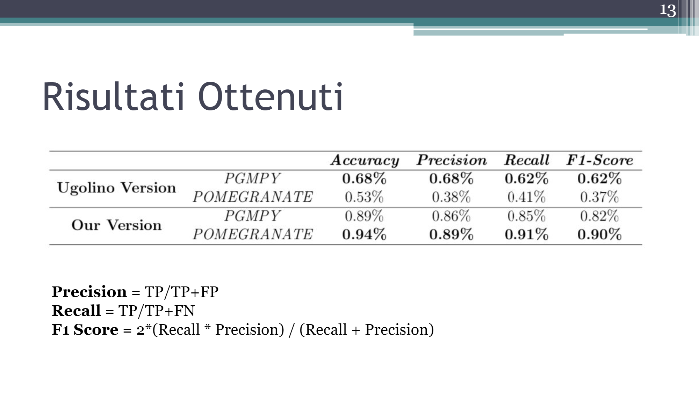

#A Bayesian Network classification model for activity recognition in HAR research area

--------------------------------
## Aim of the project
Development of bayesian network that predict the action accomplished by a subject using the coordinates point of four accelerometers.

## Dataset
+ Data acquired upon eight hour of activity
+ Four subject of different age and sex.
+ 165.633 samples

## Networks created

## Obtained results

##EXECUTE CODE - AAL PROJECT

1) Install conda environments (you can found it in folder "Environments Conda"; Windows and MacOS version)

	2a) Launch "python preprocessing_ugolino.py" --> Preprocessing of data According to W.Ugolino et al.
Or	
	2b) Launch"python preprocessing_our.py" --> Preprocessing according to our version.

3) Execute main.py
	-A bayesan network will be created using PGMPY library; evaluation of the accuracy of the model created, confusion matrix and metrics
4) Eecute model_pomegranate.py 
	-A bayesan network will be created using Pomegranatelibrary; evaluation of the accuracy of the model created, confusion matrix and metrics

For every informations about preprocessing or function used to generate the networks look at "Relazione.pdf" or contact us.

## Contact

Amrani Hamza -  h.amrani@campus.unimib.it
Brumana Mattia -  m.brumana@campus.unimib.it
Carta Costantino -  c.carta4@campus.unimib.it

Università degli Studi di Milano Bicocca
